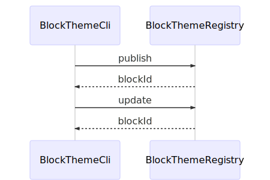

# Developing for the Element CLI

These instructions will get a copy of the project up and running on your local machine for development and testing purposes. See [Deployment](#deployment) for notes on how to publish the [CLI](https://en.wikipedia.org/wiki/Command-line_interface) to [npm](https://npmjs.org).

## Prerequisites

To ensure we're all using the same version of Node.js while developing, please use either [n](https://github.com/tj/n) or [nvm](https://github.com/creationix/nvm) to install the project's [Node.js version](/.node-version), and then install [AVN](https://github.com/wbyoung/avn), along with the relevant helper:

```bash
npm install -g avn

# If you're managing Node versions with NVM:
npm install -g avn-nvm

# If you're managing Node versions with n:
npm install -g avn-n
```

Then, set up AVN with

```bash
avn setup
```

and after following the on-screen instructions, you should be good to go &mdash; upon changing to this directory, you'll be automatically switched to use the correct version of Node.js, specified in the `.node-version` file.

## Installing

From the repo root:

```bash
npm install
npm run build
```

_Run `npm run build` every time you want to compile and transpile your code._

## Preparing to Use the CLI

You'll need to build your latest changes and then symlink the file in `bin/src/index.js` using the following commands:

```bash
npm run build
npm link
```

Open another terminal window and try it out in a different directory: `element --help`.

If you get an error finding `element`, make sure the node executable is added to your path.  The location is returned from the `npm link` command or you can run `which node`.  Here's a sample path:

```bash
export PATH="$PATH:/usr/local/lib/node_modules/node/bin/"
```

If you get an error related to its ability to execute, try adjusting the permissions using [`chmod`](https://www.computerhope.com/unix/uchmod.htm):

```bash
chmod +x /usr/local/bin/element
```

## Exercising the CLI Locally

As you continue to make changes to the CLI's source code, re-build your changes:

```bash
# watches the directory and rebuilds after changes are saved
npm run watch
# or build once with `npm run build`
```

and your updated code will be used next time you call the CLI.

## Running Tests

### `npm run test`

   Builds and runs the unit tests

### `npm run test:e2e`

    Builds and runs the end-to-end tests

### `npm run test:cov`

    Outputs statistics about code coverage of unit tests

### `npm run test:unit`

    Runs the unit tests

### `npm run test:watch`

    Starts the unit tests and watches for changes to the source and test files

## Versioning

We use [SemVer](http://semver.org/) for versioning. For the versions available, see the [tags on this repository](https://github.com/volusion/element-cli/tags).

## Generating Diagrams

Run this command to generate .svg files from any .mmd files in the `docs/` folder.

    npm run doc

## Sequence Diagram



## Deployment

`npm run release`
